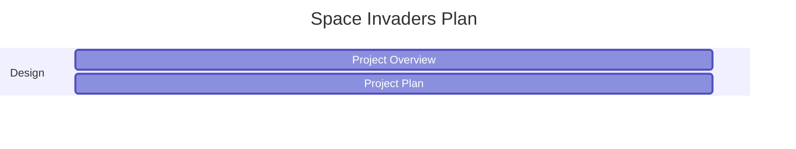

# Project Overview

this game is heavily inspired by Space Invaders. the theme of the game is a classic alien vs spacecraft

the space craft is a blue spacecraft with simalar looks to the original space invaders. the aliens are a red one-eyed alien that has similar looks to the "Doom" cacodemon. with a space background

blue SpaceCraft

Alien
## New Gameplay

### Level System
A level system will be implemented inside of the game. there will be 100 levels with enemies getting harder to defeat. when the player defeats level 100 the player will be greeted with a win scene. if the player loses to a level the player will be directed to a lose screen and have to restart the entire game.
### Boss Battles
There will be a boss battle every 10 levels. Each boss battle will be unique and use different weapons against the player.
### In game currency 
After the player complete a game session, the player will earn points. the amount of points depends on the amount of enemies defeated and levels passed.
### New Weapons and Weapon Shop
There will be a shop button on the main menu. it leads to a menu of different weapons which can be bought with points. when the player starts the game they will be equipped with the generic laser. then will be able to buy weapons like rocket launchers (shoots explosion and takes out enemies), bomb (like rocket launcher but slower and more impactful), speed lasers (shoots faster then generic laser), shotgun laser (shoot out laser in burst), and an AK-47 (Insta-kills anything)
### Emeny Types

### Enemy Health

# Behaviour - User Journey

# Planning Diagram

